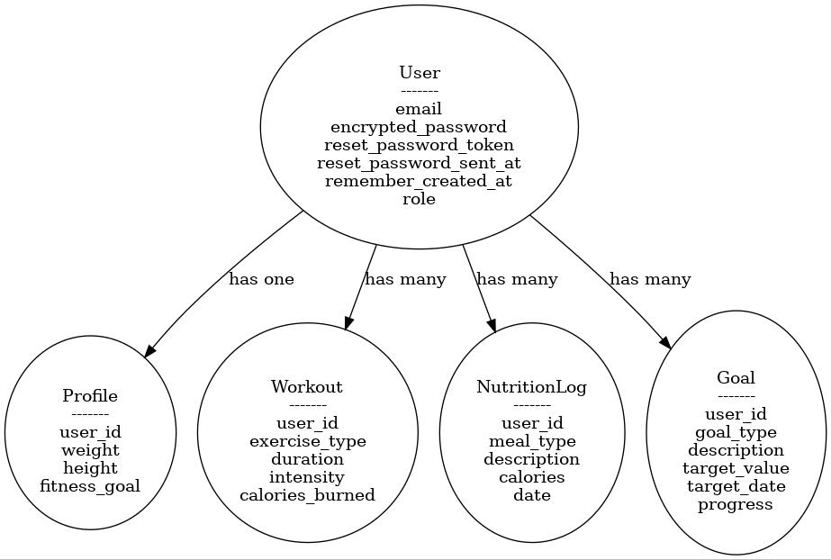
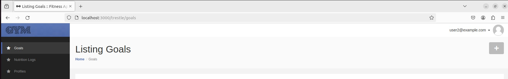
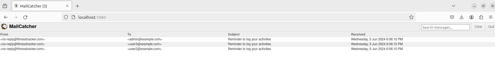

# Ruby on Rails Fitness Apps with Trestle theme

### Description:
Develop a web application that helps users track their fitness activities, set goals, and monitor their progress over time. Users can log workouts, record their nutrition intake, and track various health metrics.

### Key Features
* User Authentication: Implement user authentication to allow users to sign up, log in, and access their personalized fitness profiles.
* Profile Creation: Allow users to create profiles and set personal fitness goals, such as weight loss, muscle gain, or improved endurance.
* Workout Logging: Enable users to log their workouts, including details such as exercise type, duration, intensity, and calories burned.
* Nutrition Tracking: Provide tools for users to track their daily nutrition intake, including meals, snacks, and hydration.
* Goal Setting: Allow users to set specific fitness goals, such as target weights, body measurements, or performance milestones, and track their progress towards these goals.
* Progress Tracking: Display visual representations of users' progress over time, such as charts, graphs, or statistics, to help them stay motivated and focused on their goals.
* Activity Analysis: Analyse users' activity data to provide insights and recommendations for improving their fitness routines, such as suggesting new exercises or adjusting calorie intake..
* Reminder Notifications: Implement reminder notifications to prompt users to log their workouts, meals, or other activities at regular intervals throughout the day.


#### Build Docker Image:
```
docker compose build
```

#### Running Docker Container:

```
docker compose up -d
```

#### Create database & database migrate & seed database:

```
docker exec rails bash -c 'rails db:create && rails db:migrate && rails db:seed'
```
#### DB Config:

```
host: localhost/db(within docker)
username: mysql
database: mysql_db
password: mysql
port: 3306
```

#### DB ERD Diagram:


#### Technical Details:
* Devise to manage authentication
* Redis queueing jobs
* Sidekiq, whenever & mailcatcher to send email
* Used Trestle theme

#### Web URL Details:
* http://localhost:3000/trestle [Rails Apps]



#### Redis URL Details:

* redis-cli -h localhost ping [Host]
* redis-cli -h redis ping [Within container]

#### Mailcatcher:


#### Sample CURL request to send email from Host:

```
curl --url smtp://localhost:1025 --mail-from "sender@email.co" --mail-rcpt "receiver@email.co"  --upload-file email.txt
```

#### Manually triggger email from Rails container:
```
/bin/bash -l -c 'cd /myapp && bundle exec bin/rails runner -e development '\''User.send_reminders'\'''
```

#### User credentials:
  email: 'user1@example.com'
  password: 'password'

  email: 'user2@example.com'
  password: 'password'